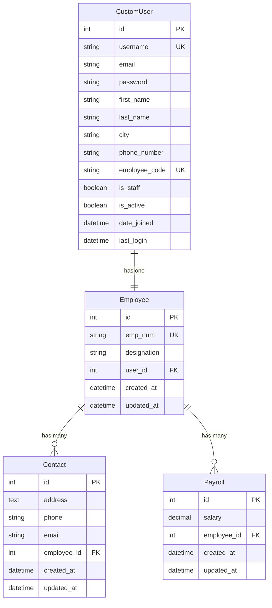
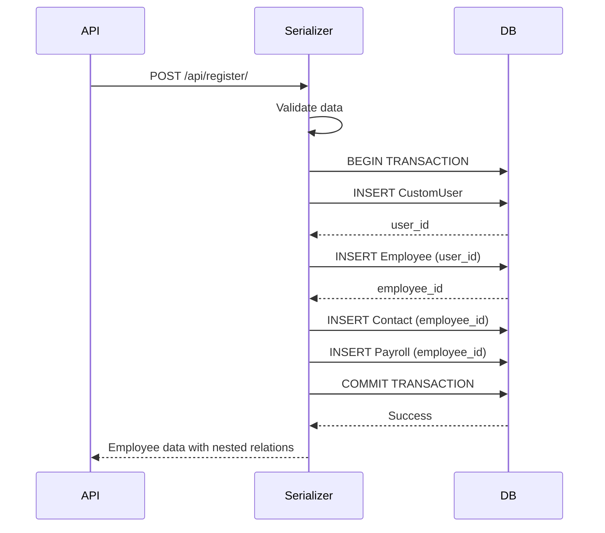
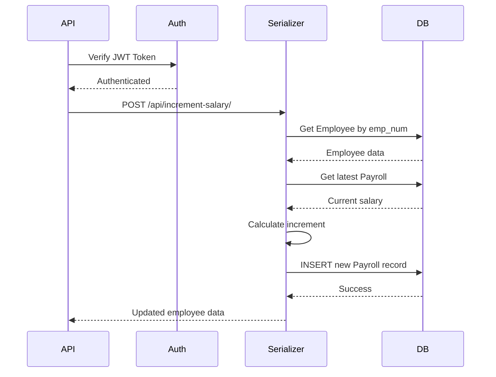

# Database Schema Documentation

## Overview

This document describes the database schema for the Django Employee Management System. The system uses MySQL as the database backend and implements a custom user model with employee, contact, and payroll relationships.

---

## Entity Relationship Diagram



---

## Table Structures

### 1. company_details_customuser

**Purpose**: Stores user authentication and profile information

**Inherits From**: Django's AbstractUser

| Column Name | Data Type | Constraints | Description |
|-------------|-----------|-------------|-------------|
| id | BIGINT | PRIMARY KEY, AUTO_INCREMENT | Unique identifier |
| username | VARCHAR(150) | UNIQUE, NOT NULL | Login username |
| email | VARCHAR(254) | NOT NULL | Email address |
| password | VARCHAR(128) | NOT NULL | Hashed password |
| first_name | VARCHAR(150) | | First name |
| last_name | VARCHAR(150) | | Last name |
| city | VARCHAR(100) | | City of residence |
| phone_number | VARCHAR(15) | | Contact phone number |
| employee_code | VARCHAR(20) | UNIQUE, NOT NULL | Unique employee code |
| is_staff | BOOLEAN | DEFAULT FALSE | Admin access flag |
| is_active | BOOLEAN | DEFAULT TRUE | Account active flag |
| is_superuser | BOOLEAN | DEFAULT FALSE | Superuser flag |
| date_joined | DATETIME | NOT NULL | Account creation date |
| last_login | DATETIME | | Last login timestamp |

**Indexes**:
- PRIMARY KEY on `id`
- UNIQUE INDEX on `username`
- UNIQUE INDEX on `employee_code`

**Sample Data**:
```sql
INSERT INTO company_details_customuser 
(username, email, password, first_name, last_name, city, phone_number, employee_code, is_staff, is_active, date_joined)
VALUES 
('john_doe', 'john@example.com', 'pbkdf2_sha256$...', 'John', 'Doe', 'New York', '+1234567890', 'EMP001', FALSE, TRUE, NOW());
```

---

### 2. company_details_employee

**Purpose**: Stores employee-specific information

| Column Name | Data Type | Constraints | Description |
|-------------|-----------|-------------|-------------|
| id | BIGINT | PRIMARY KEY, AUTO_INCREMENT | Unique identifier |
| emp_num | VARCHAR(20) | UNIQUE, NOT NULL | Employee number |
| designation | VARCHAR(100) | NOT NULL | Job title/position |
| user_id | BIGINT | FOREIGN KEY, UNIQUE, NOT NULL | Reference to CustomUser |
| created_at | DATETIME | NOT NULL | Record creation date |
| updated_at | DATETIME | NOT NULL | Last update date |

**Relationships**:
- `user_id` → `company_details_customuser.id` (OneToOne)
  - ON DELETE: CASCADE
  - ON UPDATE: CASCADE

**Indexes**:
- PRIMARY KEY on `id`
- UNIQUE INDEX on `emp_num`
- UNIQUE INDEX on `user_id`

**Sample Data**:
```sql
INSERT INTO company_details_employee 
(emp_num, designation, user_id, created_at, updated_at)
VALUES 
('E001', 'Software Engineer', 1, NOW(), NOW());
```

---

### 3. company_details_contact

**Purpose**: Stores contact information for employees

| Column Name | Data Type | Constraints | Description |
|-------------|-----------|-------------|-------------|
| id | BIGINT | PRIMARY KEY, AUTO_INCREMENT | Unique identifier |
| address | TEXT | NOT NULL | Physical address |
| phone | VARCHAR(15) | NOT NULL | Contact phone number |
| email | VARCHAR(254) | NOT NULL | Contact email |
| employee_id | BIGINT | FOREIGN KEY, NOT NULL | Reference to Employee |
| created_at | DATETIME | NOT NULL | Record creation date |
| updated_at | DATETIME | NOT NULL | Last update date |

**Relationships**:
- `employee_id` → `company_details_employee.id` (ForeignKey)
  - ON DELETE: CASCADE
  - ON UPDATE: CASCADE

**Indexes**:
- PRIMARY KEY on `id`
- INDEX on `employee_id`

**Sample Data**:
```sql
INSERT INTO company_details_contact 
(address, phone, email, employee_id, created_at, updated_at)
VALUES 
('123 Main St, New York, NY 10001', '+1234567890', 'john@example.com', 1, NOW(), NOW());
```

---

### 4. company_details_payroll

**Purpose**: Stores salary information and maintains salary history

| Column Name | Data Type | Constraints | Description |
|-------------|-----------|-------------|-------------|
| id | BIGINT | PRIMARY KEY, AUTO_INCREMENT | Unique identifier |
| salary | DECIMAL(10,2) | NOT NULL | Salary amount |
| employee_id | BIGINT | FOREIGN KEY, NOT NULL | Reference to Employee |
| created_at | DATETIME | NOT NULL | Record creation date |
| updated_at | DATETIME | NOT NULL | Last update date |

**Relationships**:
- `employee_id` → `company_details_employee.id` (ForeignKey)
  - ON DELETE: CASCADE
  - ON UPDATE: CASCADE

**Indexes**:
- PRIMARY KEY on `id`
- INDEX on `employee_id`
- INDEX on `created_at` (descending)
- COMPOSITE INDEX on `(employee_id, created_at)` (descending)

**Sample Data**:
```sql
INSERT INTO company_details_payroll 
(salary, employee_id, created_at, updated_at)
VALUES 
(50000.00, 1, NOW(), NOW());
```

---

## Relationship Details

### 1. CustomUser ↔ Employee (OneToOne)

**Type**: One-to-One Relationship

**Description**: Each CustomUser has exactly one Employee record, and each Employee belongs to exactly one CustomUser.

**Implementation**:
```python
class Employee(models.Model):
    user = models.OneToOneField(
        CustomUser,
        on_delete=models.CASCADE,
        related_name='employee'
    )
```

**Access Patterns**:
```python
# From User to Employee
user = CustomUser.objects.get(username='john_doe')
employee = user.employee

# From Employee to User
employee = Employee.objects.get(emp_num='E001')
user = employee.user
```

**Database Constraint**:
- `user_id` in `company_details_employee` is UNIQUE
- Foreign key constraint ensures referential integrity

---

### 2. Employee ↔ Contact (One-to-Many)

**Type**: One-to-Many Relationship

**Description**: Each Employee can have multiple Contact records, but each Contact belongs to exactly one Employee.

**Implementation**:
```python
class Contact(models.Model):
    employee = models.ForeignKey(
        Employee,
        on_delete=models.CASCADE,
        related_name='contacts'
    )
```

**Access Patterns**:
```python
# From Employee to Contacts
employee = Employee.objects.get(emp_num='E001')
contacts = employee.contacts.all()

# From Contact to Employee
contact = Contact.objects.get(id=1)
employee = contact.employee
```

**Database Constraint**:
- Foreign key constraint on `employee_id`
- Cascade delete: deleting an Employee deletes all related Contacts

---

### 3. Employee ↔ Payroll (One-to-Many)

**Type**: One-to-Many Relationship

**Description**: Each Employee can have multiple Payroll records (salary history), but each Payroll belongs to exactly one Employee.

**Implementation**:
```python
class Payroll(models.Model):
    employee = models.ForeignKey(
        Employee,
        on_delete=models.CASCADE,
        related_name='payrolls'
    )
```

**Access Patterns**:
```python
# From Employee to Payrolls
employee = Employee.objects.get(emp_num='E001')
payrolls = employee.payrolls.all().order_by('-created_at')
current_salary = employee.payrolls.first().salary

# From Payroll to Employee
payroll = Payroll.objects.get(id=1)
employee = payroll.employee
```

**Database Constraint**:
- Foreign key constraint on `employee_id`
- Cascade delete: deleting an Employee deletes all related Payroll records
- Indexed for efficient querying by date

---

## Data Flow Diagrams

### Employee Registration Flow



### Salary Increment Flow



---

## Query Patterns

### 1. Get Employee with All Related Data

```python
employee = Employee.objects.select_related('user').prefetch_related(
    'contacts', 'payrolls'
).get(emp_num='E001')
```

**SQL Equivalent**:
```sql
-- Main query
SELECT * FROM company_details_employee e
INNER JOIN company_details_customuser u ON e.user_id = u.id
WHERE e.emp_num = 'E001';

-- Prefetch contacts
SELECT * FROM company_details_contact
WHERE employee_id IN (1);

-- Prefetch payrolls
SELECT * FROM company_details_payroll
WHERE employee_id IN (1)
ORDER BY created_at DESC;
```

### 2. Get High Salary Employees

```python
from django.db.models import OuterRef, Subquery

latest_payroll = Payroll.objects.filter(
    employee=OuterRef('pk')
).order_by('-created_at')

employees = Employee.objects.annotate(
    current_salary=Subquery(latest_payroll.values('salary')[:1])
).filter(current_salary__gt=10000)
```

**SQL Equivalent**:
```sql
SELECT e.*, 
       (SELECT p.salary 
        FROM company_details_payroll p 
        WHERE p.employee_id = e.id 
        ORDER BY p.created_at DESC 
        LIMIT 1) as current_salary
FROM company_details_employee e
HAVING current_salary > 10000;
```

### 3. Get Employee Count by City

```python
from django.db.models import Count

stats = CustomUser.objects.values('city').annotate(
    employee_count=Count('id')
).order_by('-employee_count')
```

**SQL Equivalent**:
```sql
SELECT city, COUNT(*) as employee_count
FROM company_details_customuser
GROUP BY city
ORDER BY employee_count DESC;
```

---

## Database Migrations

### Initial Migration

The initial migration creates all tables with proper relationships:

```bash
python manage.py makemigrations
python manage.py migrate
```

### Migration Files

1. **0001_initial.py**: Creates CustomUser, Employee, Contact, Payroll tables
2. Includes all foreign key constraints
3. Creates indexes for performance

### Viewing Migration SQL

```bash
python manage.py sqlmigrate company_details 0001
```

---

## Performance Optimization

### 1. Indexes

**Existing Indexes**:
- Primary keys on all tables
- Unique indexes on `username`, `employee_code`, `emp_num`
- Foreign key indexes on `user_id`, `employee_id`
- Descending index on `payroll.created_at`
- Composite index on `(employee_id, created_at)`

### 2. Query Optimization

**Use select_related for OneToOne/ForeignKey**:
```python
# Good - 1 query
Employee.objects.select_related('user').get(emp_num='E001')

# Bad - 2 queries (N+1 problem)
employee = Employee.objects.get(emp_num='E001')
user = employee.user
```

**Use prefetch_related for reverse ForeignKey**:
```python
# Good - 3 queries total
Employee.objects.prefetch_related('contacts', 'payrolls').all()

# Bad - N+1 queries
for employee in Employee.objects.all():
    contacts = employee.contacts.all()  # Query per employee!
```

### 3. Database Connection Pooling

Configure in `settings.py`:
```python
DATABASES = {
    'default': {
        'ENGINE': 'django.db.backends.mysql',
        'OPTIONS': {
            'init_command': "SET sql_mode='STRICT_TRANS_TABLES'",
            'charset': 'utf8mb4',
        },
        'CONN_MAX_AGE': 600,  # Connection pooling
    }
}
```

---

## Data Integrity

### 1. Cascade Deletes

When a CustomUser is deleted:
1. Associated Employee is deleted (CASCADE)
2. All Contacts for that Employee are deleted (CASCADE)
3. All Payroll records for that Employee are deleted (CASCADE)

### 2. Unique Constraints

- `username`: Ensures no duplicate usernames
- `employee_code`: Ensures no duplicate employee codes
- `emp_num`: Ensures no duplicate employee numbers
- `user_id` in Employee: Ensures one employee per user

### 3. Validation

**Model-level validation**:
- Phone number format validation
- Email format validation
- Required field validation

**Database-level constraints**:
- NOT NULL constraints
- UNIQUE constraints
- FOREIGN KEY constraints

---

## Backup and Restore

### Backup Database

```bash
mysqldump -u root -p django_test_db > backup.sql
```

### Restore Database

```bash
mysql -u root -p django_test_db < backup.sql
```

### Django Fixtures

**Export data**:
```bash
python manage.py dumpdata company_details > data.json
```

**Import data**:
```bash
python manage.py loaddata data.json
```

---

## Database Administration

### Useful SQL Queries

**1. Count employees by designation**:
```sql
SELECT designation, COUNT(*) as count
FROM company_details_employee
GROUP BY designation
ORDER BY count DESC;
```

**2. Get salary history for an employee**:
```sql
SELECT p.salary, p.created_at
FROM company_details_payroll p
JOIN company_details_employee e ON p.employee_id = e.id
WHERE e.emp_num = 'E001'
ORDER BY p.created_at DESC;
```

**3. Find employees with multiple contacts**:
```sql
SELECT e.emp_num, COUNT(c.id) as contact_count
FROM company_details_employee e
LEFT JOIN company_details_contact c ON c.employee_id = e.id
GROUP BY e.id, e.emp_num
HAVING contact_count > 1;
```

**4. Average salary by city**:
```sql
SELECT u.city, AVG(p.salary) as avg_salary
FROM company_details_customuser u
JOIN company_details_employee e ON e.user_id = u.id
JOIN company_details_payroll p ON p.employee_id = e.id
WHERE p.created_at = (
    SELECT MAX(created_at) 
    FROM company_details_payroll 
    WHERE employee_id = e.id
)
GROUP BY u.city
ORDER BY avg_salary DESC;
```

---

## Troubleshooting

### Common Issues

**1. Foreign Key Constraint Violation**:
```
IntegrityError: Cannot add or update a child row: a foreign key constraint fails
```
**Solution**: Ensure the referenced record exists before creating the child record.

**2. Duplicate Entry**:
```
IntegrityError: Duplicate entry 'EMP001' for key 'employee_code'
```
**Solution**: Use unique employee codes, usernames, and employee numbers.

**3. Migration Conflicts**:
```
InconsistentMigrationHistory
```
**Solution**: 
```bash
python manage.py migrate --fake company_details zero
python manage.py migrate company_details
```

---

## Schema Evolution

### Adding New Fields

1. Add field to model
2. Create migration: `python manage.py makemigrations`
3. Review migration file
4. Apply migration: `python manage.py migrate`

### Example: Adding department field

```python
# In models.py
class Employee(models.Model):
    # ... existing fields ...
    department = models.CharField(max_length=100, default='General')
```

```bash
python manage.py makemigrations
python manage.py migrate
```

---

## Summary

This database schema provides:

✅ **Custom user authentication** with employee-specific fields  
✅ **Normalized data structure** with proper relationships  
✅ **Salary history tracking** through multiple payroll records  
✅ **Data integrity** through foreign key constraints  
✅ **Performance optimization** through strategic indexing  
✅ **Scalability** for future enhancements  

The schema follows Django best practices and MySQL optimization techniques for a robust employee management system.
